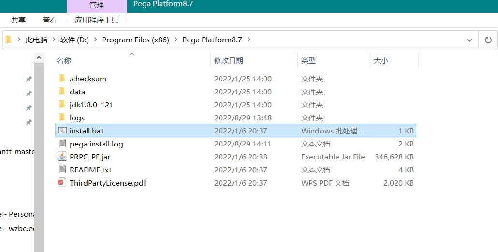

# 一、打开Pega官网

https://academy.pega.com/

# 二、登录，进入My Pega

# 三、下载PegaPlatform

# 四、解压得到下面的文件

# 五、安装

`双击上面的install.bat会开始安装`

# 六、启动

`安装完成后启动可能会报错，这时就可能需要修改启动脚本和关闭脚本，因为有些电脑已经配置了全局的tomcat环境变量，但是pega要求使用pega自带的tomcat，所以需要修改启动脚本`

`在启动脚本install.bat和关闭脚本shutdown.bat中添加如下选中的配置`

`然后就可以启动成功了`