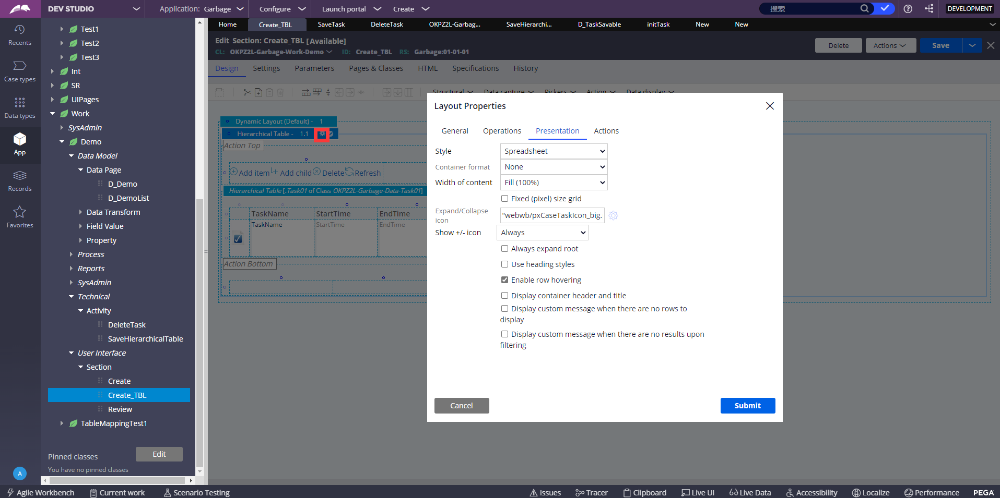

1、使用六里面新建的Data Type

2、点击左边的App，刷新一下，我们的Data层就会出来一个绿色叶子的Task01（你们新建的Data Type的名字，和我的可能不一样）

5、然后再Data下面新建一个Section，命名为NewTask，里面的视图设计成HierarchicalTable点击Add item按钮弹出来的东西

6、接下来，我们去Work层，新建一个和刚刚在Data新建的同名的class叫Task01，然后更改类型为Pege List，下面会多一个Pege definition的选项，是继承的意思，我们选Data里面的Task01的class路径，save，然后Task01下面就会多一层NewTask(这是Data Type里的字段，自己建的，你们可能没有)

7、然后在Work下面的项目中的Section中，打开我们的Case Type的视图，我的是Create这个，里面拖一个Navigation tree进去

8、然后设置Navigation tree，General里面的List设置为.Task01，这个就是Data里面的那个Task01

9、Operation里面这样设置，这是设置点击Add item时的动作，点击Detail flow action右边的按钮新建一个OpenTask，里面的Section就选我们在Data下面新建的那个NewTask

Navigation tree只能显示一列数据，所以我们使用Hierarchial Table来显示多列数据

1、把之前的Navigation tree替换成Hierarchial table

2、Presentation里面这样设置，General里面拉到下面，要勾选一下，其他设置和Navigation tree的设置一样（Expand Icon是图标设置，必须设置图标，否则无法显示数据，和Navigation tree一样只会显示一个文件夹图标）

3、table里面设置一下要显示的字段，我这里举其中一列的例子

4、成品

