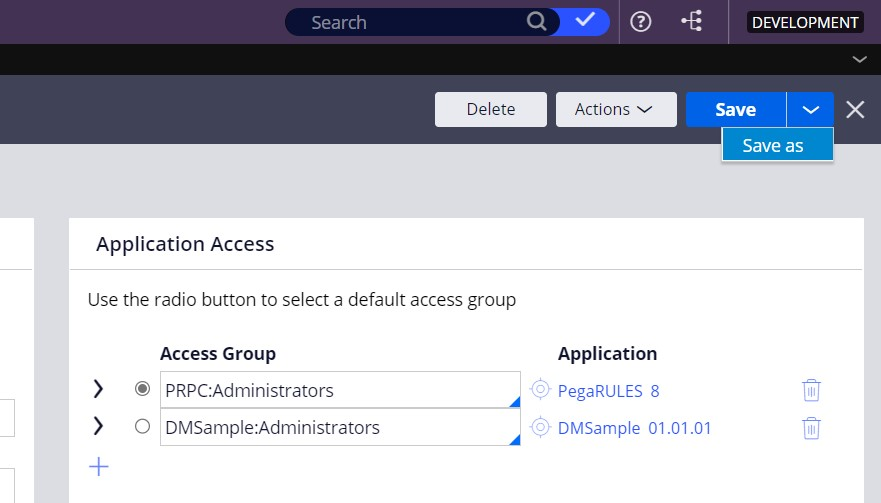
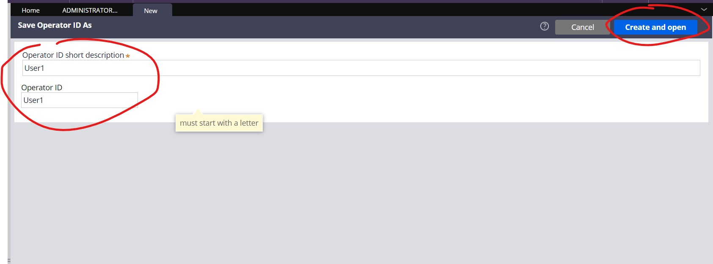
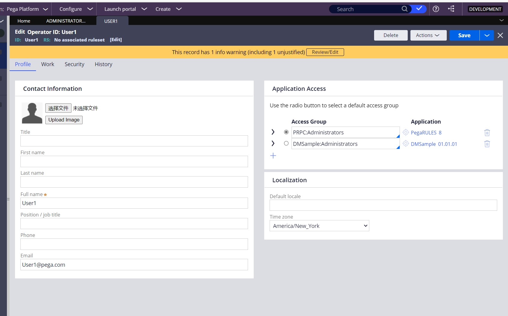
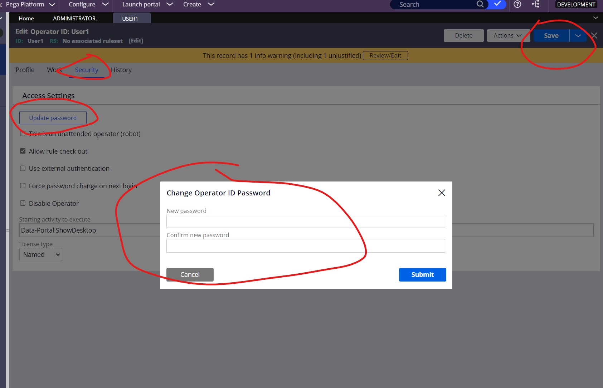

# 登入PegaPlatform

`使用Administrator@pega.com账号登入Pega Platform，默认密码是 install，我们要使用此账号来新建一个用户用于工作，因为Administrator@pega.com是管理员账号，最好不要使用此账号进行开发工作。`

# 点击头像-Operator，得到以下页面

# 点击右上角'Save as'

# 设置登录账户名，create and open

# 设置profile和修改password，然后点击 Save

然后就可以使用 User1 用户名进行登录了