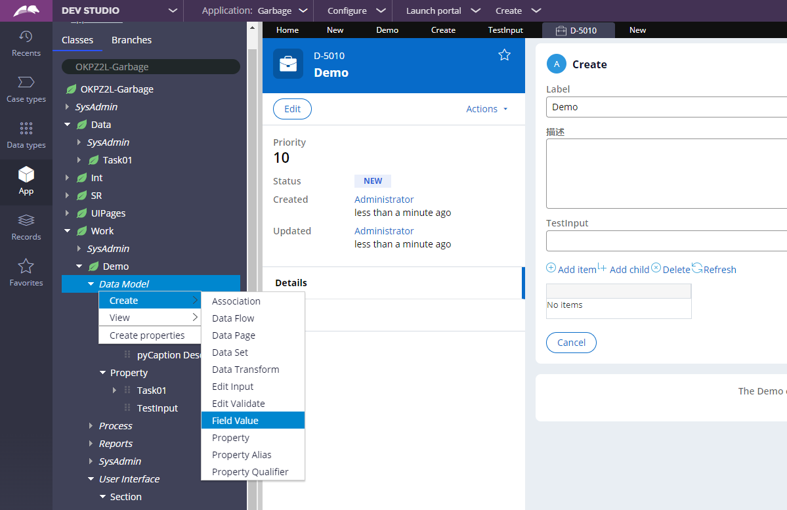
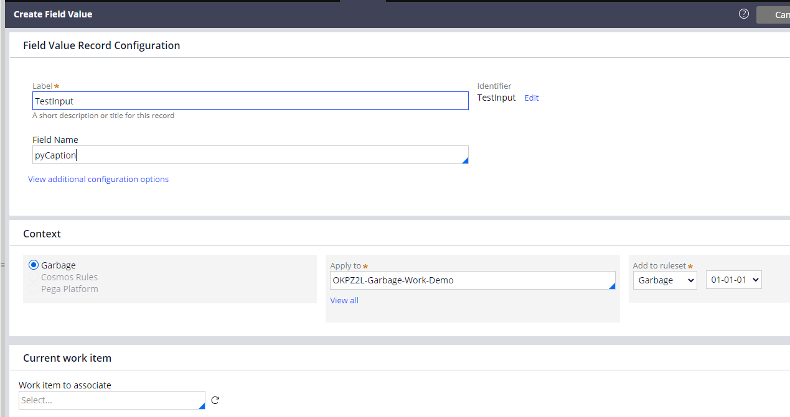
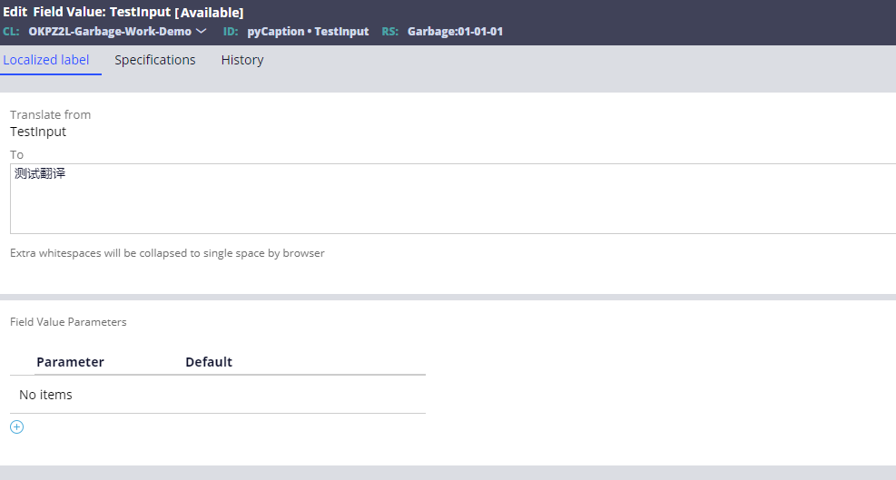
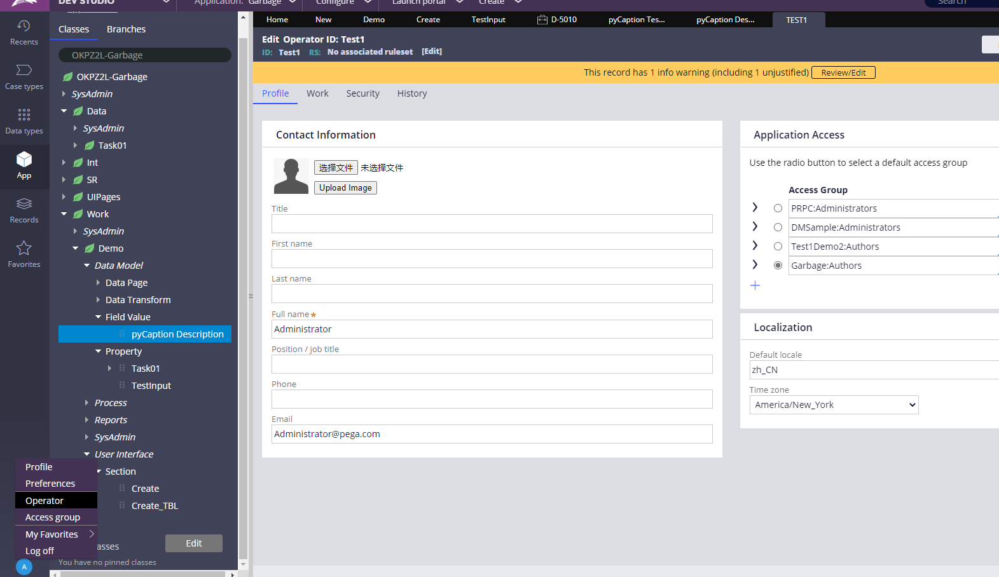
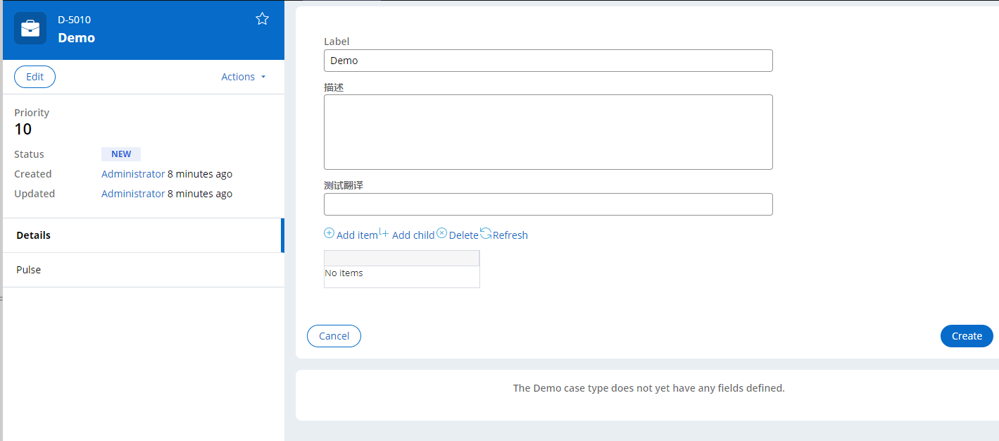

1、我们要翻译TestInput，在左边App里面找到我们的Application，在work里面的Data Model新建一个Fileld Value

2、Lable要和要翻译的名字“TestInput”一样，Field Name填pyCaption，其他有可能不是pyCaption，要从下面localize里面找

3、输入要翻译成的文字

4、在用户的operator里面，将Default local设置为zh_CN

5、然后就成功了

