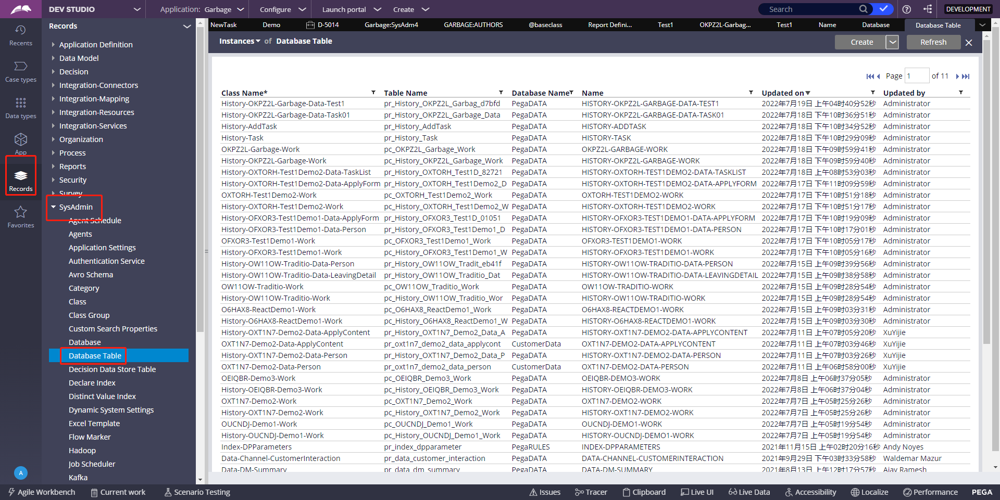
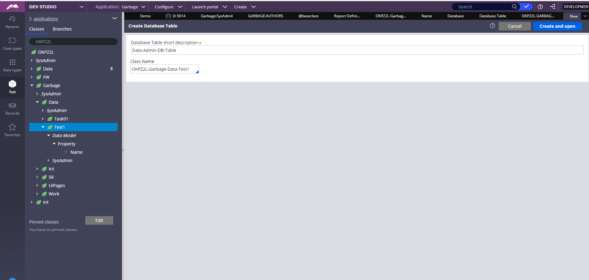
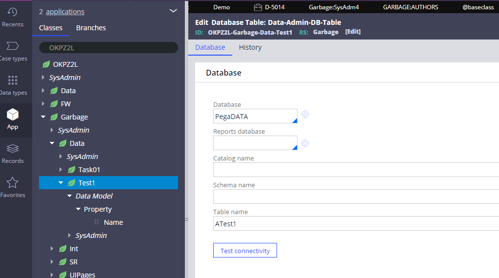

`现在有这么一个情况，如果数据库中已经有一张表了，而没有对应的Data Type，那么你可以将这张表和Data Type关联起来`

1、新建Data Type，命名Test1，略

2、指定数据库表

3、点击右上角的Create，Class Name里面输入Test1的class路径，点击Create and Open

5、填写数据库名和表名，save

然后就映射好了，可以去data层data type的defination里面test connection看一下
