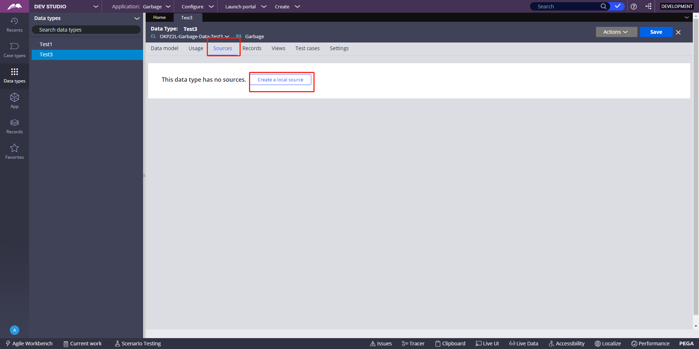
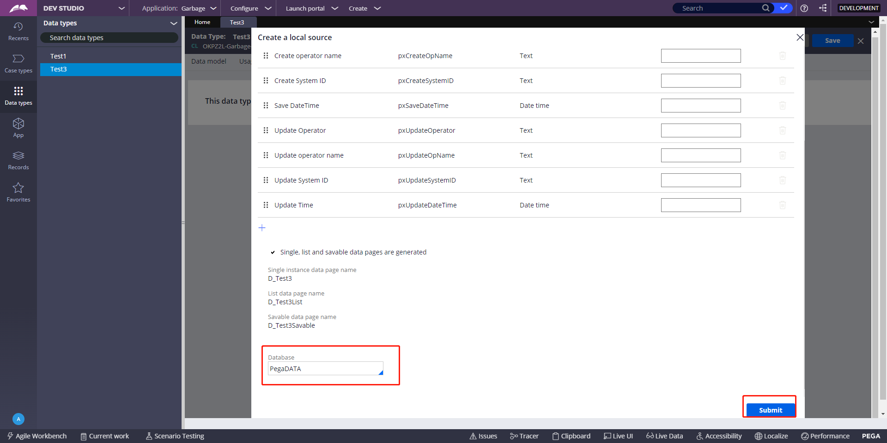
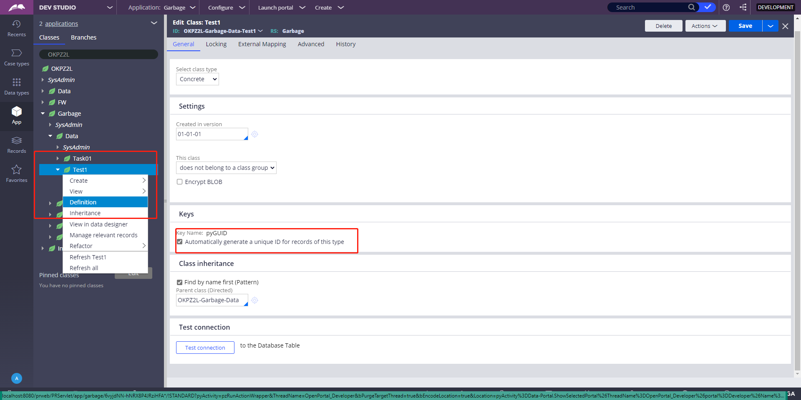
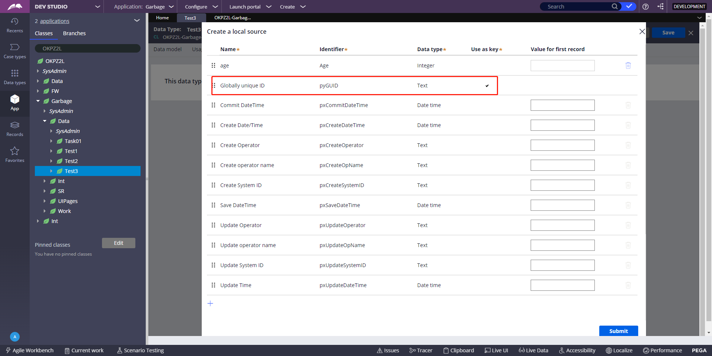
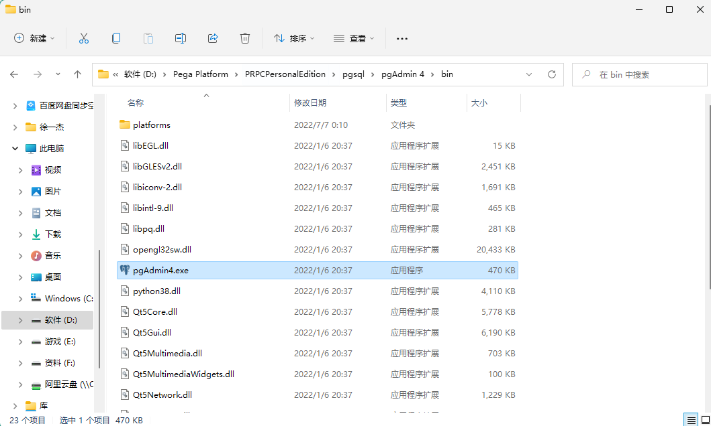

1、新建Data Type，命名Test1，里面填个字段，略

2、为Data Type指定数据库表和Data Page

3、指定数据库和Data Page

4、为Test1设置自动生成的主键，打开Test1的Definition，勾选Automatically generate…….，save就可以了

5、找到Pega PE的pgAdmin4

打开，这是一个类似于Navicate的管理工具

