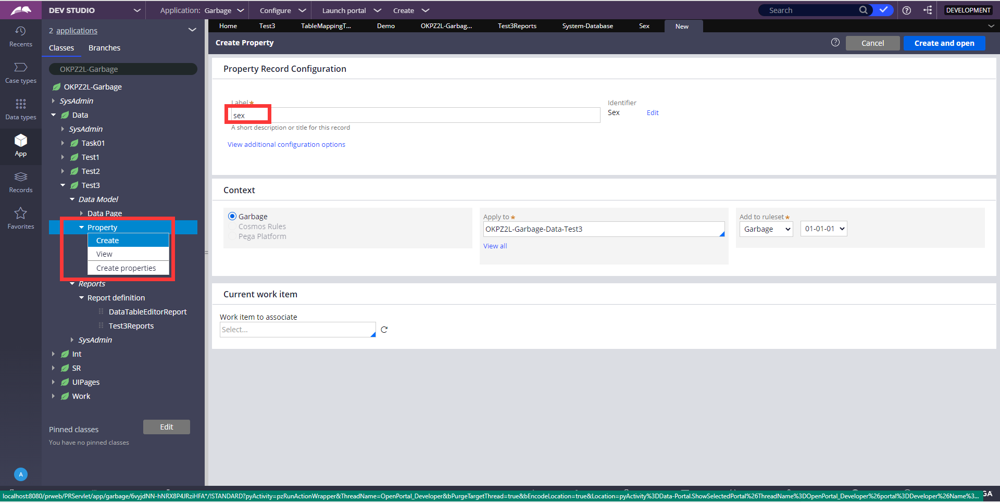
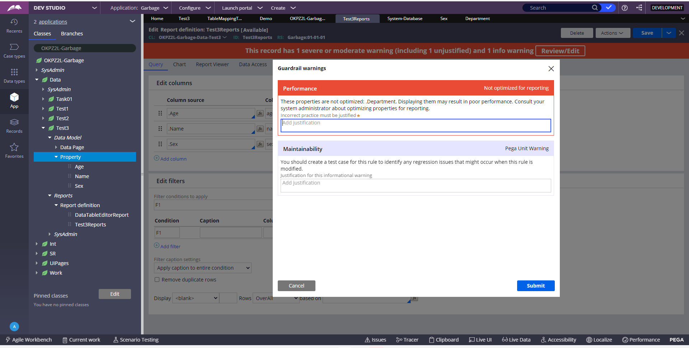
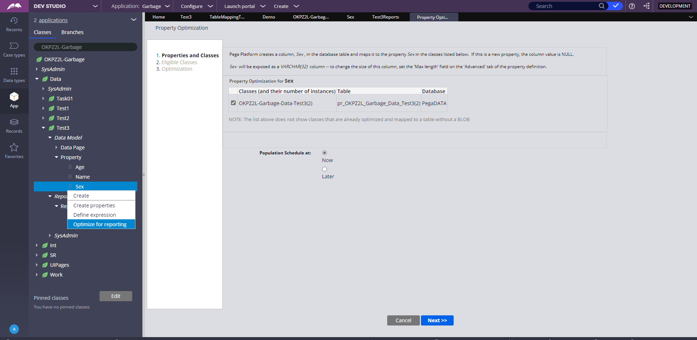
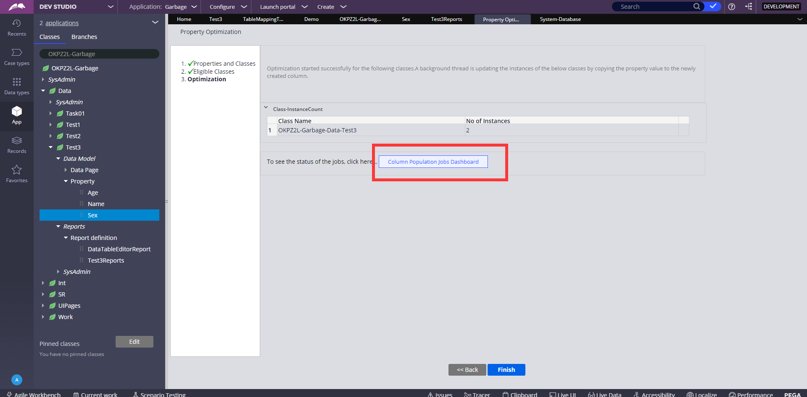
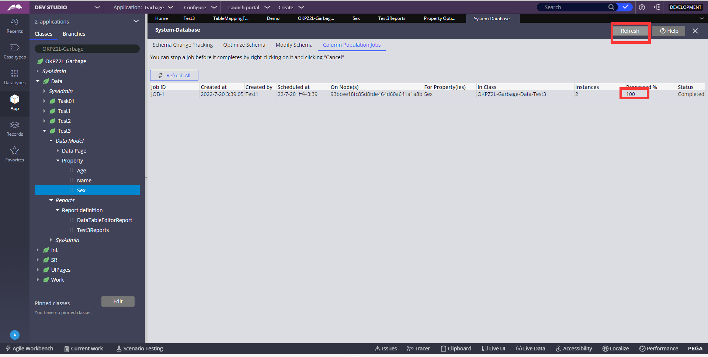
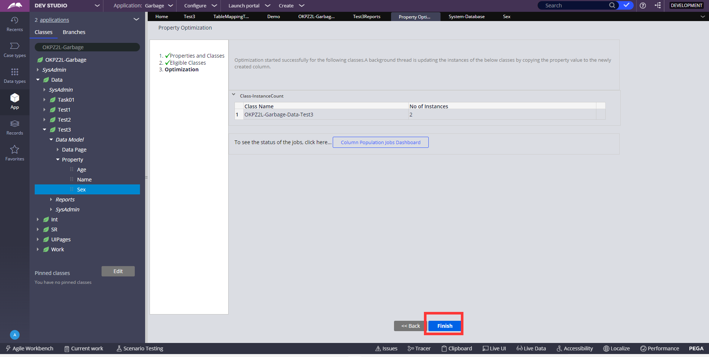
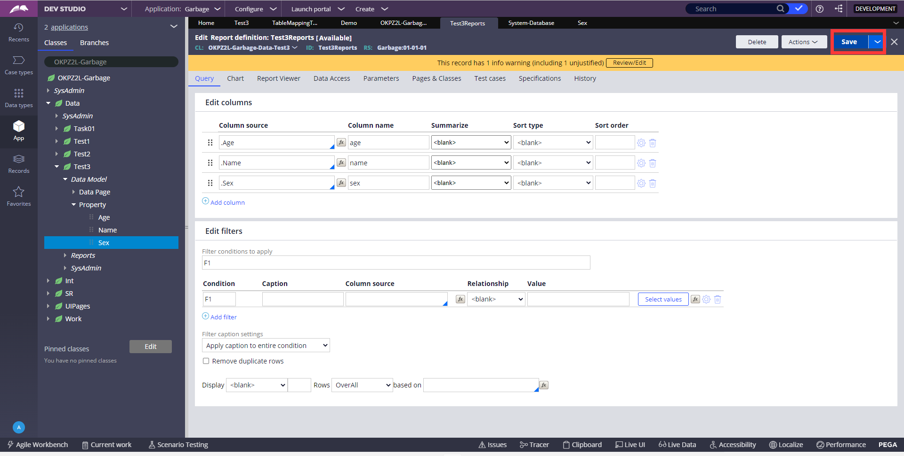
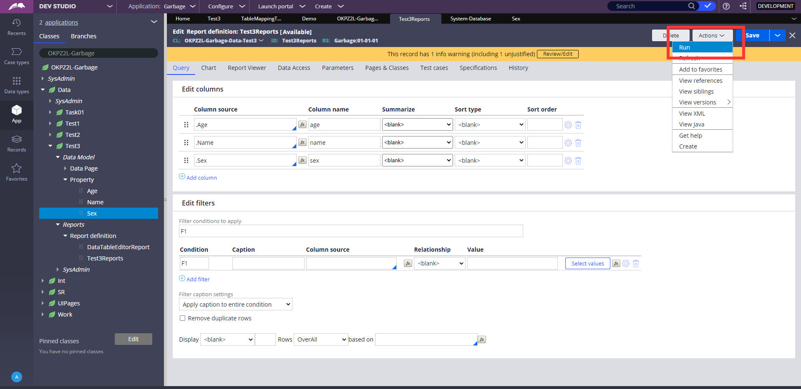
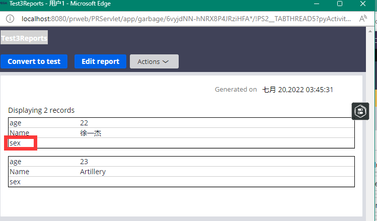

`现在有这么一种情况，有些字段可能Data Type里面有，但是数据库表里面没有，这样的话，那个字段读取需要从pyStream里面读取，性能不好，所以我们要将此字段暴露`

1、这样新建property，数据库表中就不会有这个字段，在Data Type里面新建会自动在数据库添加所建字段

2、在Reports definition里配置新建的sex字段，第一次保存会警告，因为没有暴露此字段，有性能问题

3、为sex字段添加暴露设置

4、设置暴露后，再次在Reports definition中点击save，这次警告消失

5、run一下，可以看见sex字段

