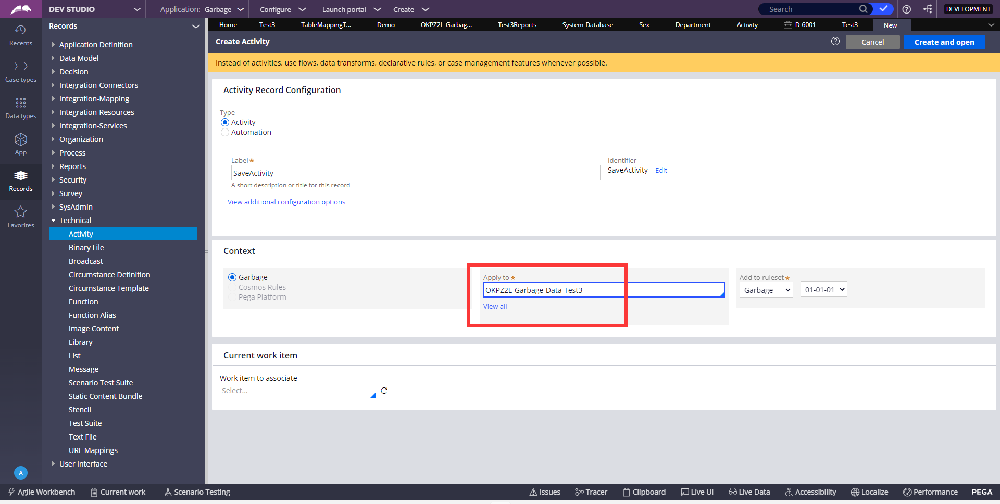
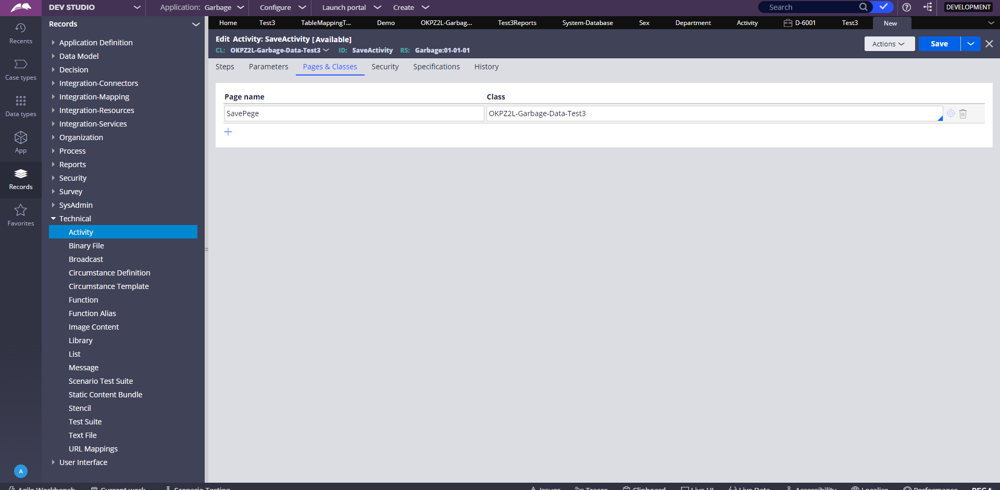
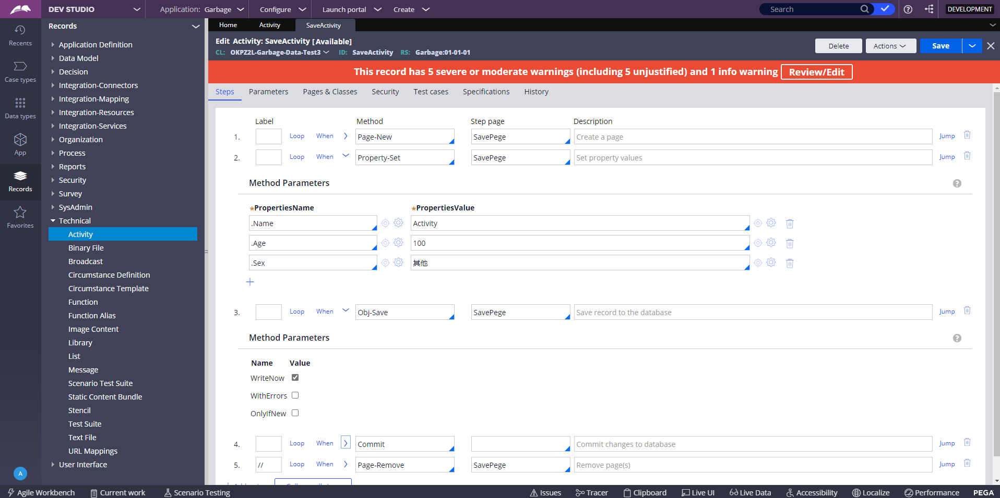
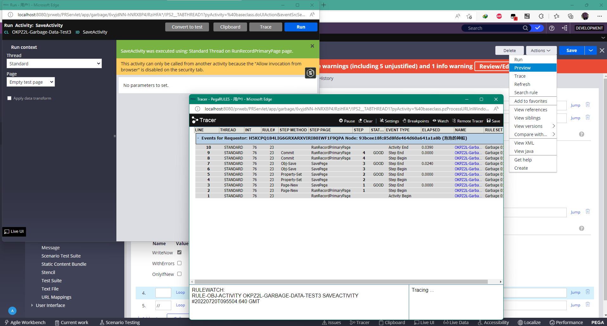
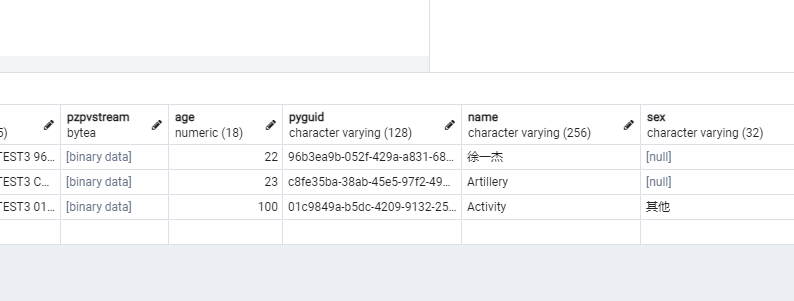

1、在左侧Records里的Technical里新建Activity，Lable里面填写这个Activity的用处，Apply to填要查询的实体类的class路径，这里我们建一个向数据库添加数据的Activity

2、Peges&Classes里面添加一条，SavePege是自己取的名字

3、如图，如果勾选了WriteNow就不需要下面的commit了，WriteNow相当于数据库的自动提交，注释掉Pege-Remove是为了在Trace里面可以查看运行过程，Pege-Remove相当于jvm的垃圾回收销毁对象。

4、点击右上角Action，Run，打开的页面的Trace可以像调试一样查看每一步的运行

5、再次点击Run以后，查看数据库，添加成功

