有点复杂，我放到Demo里面了，是Pega的项目，可以导入进你们的Pega，下面教你们Pega项目的导入导出

# 一、导出Pega项目

点击download以后会下载到一个zip压缩包

# 二、导入Pega项目要

## 1、导入

和上面第一步，不过这一次我们选择import，选择导入的文件（就是刚刚我们导出的那个zip文件，然后一直next就可以了）

## 2、配置访问权限

导入后的项目默认没有访问权限，所以我们要去点击头像-operate

点击＋，双击方向“下”键，选择我们导入的项目，save，就可以访问到了

# 三、几个关键的Activity

0、Data层的 Process 里面有一个 Flow Action，这是打开添加数据的弹窗的，在Section中调用，忘记截图了

1、GetTaskList，从数据库拉取数据

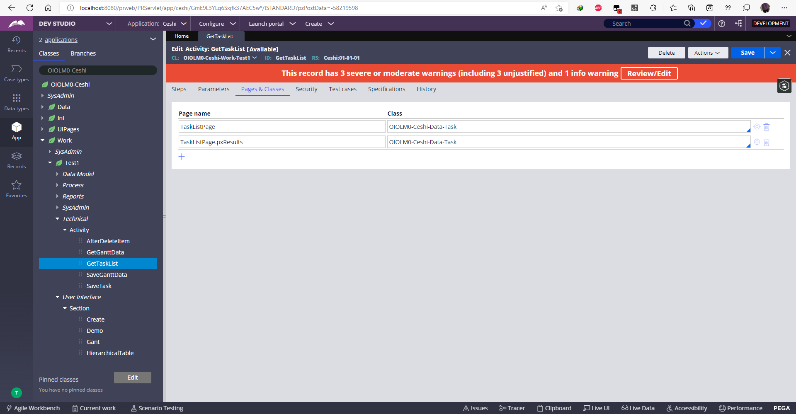
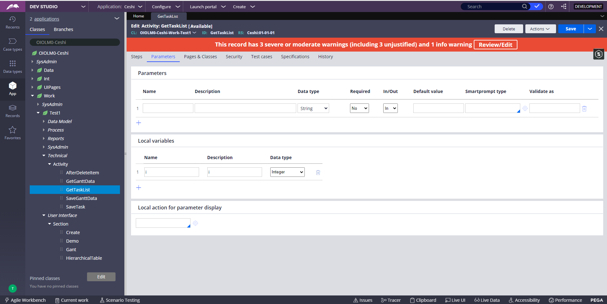
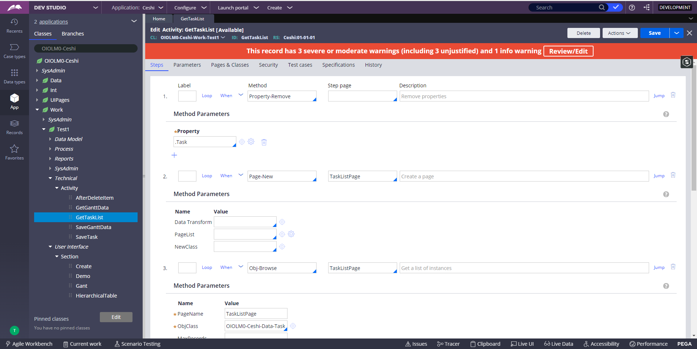
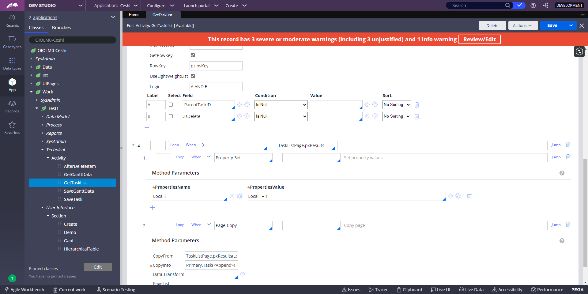

2、SaveTask

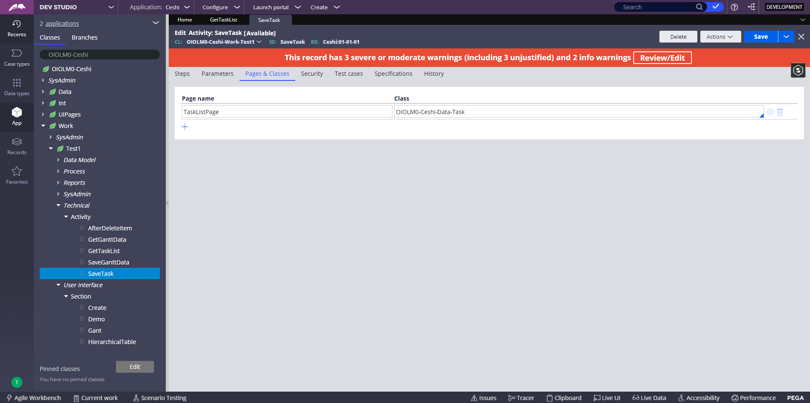
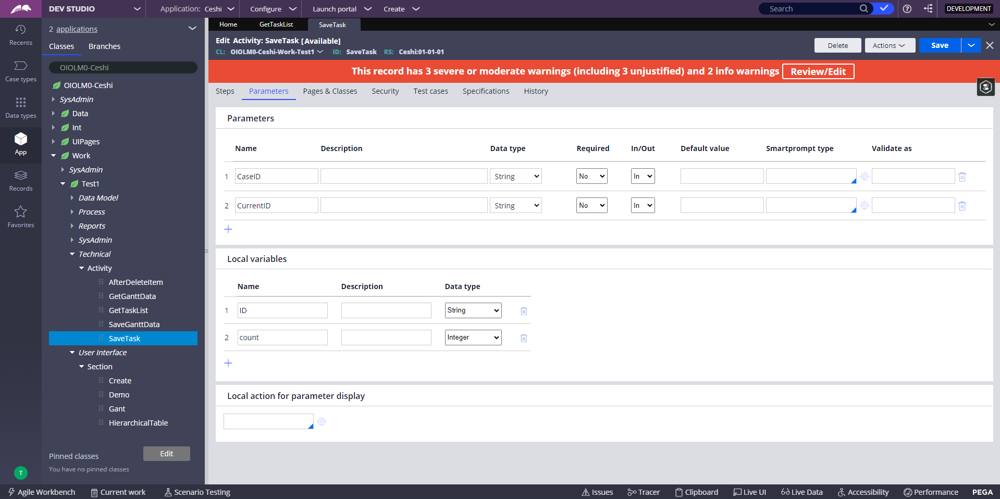
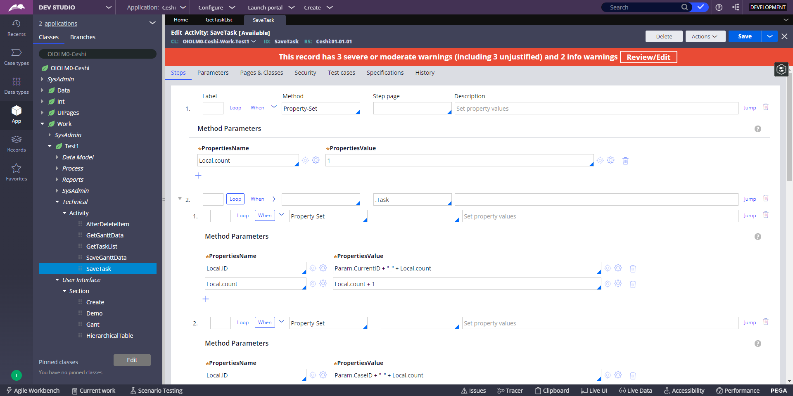
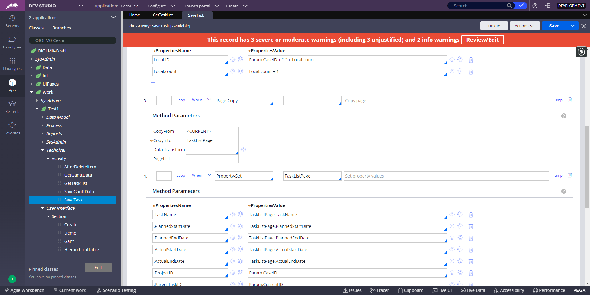
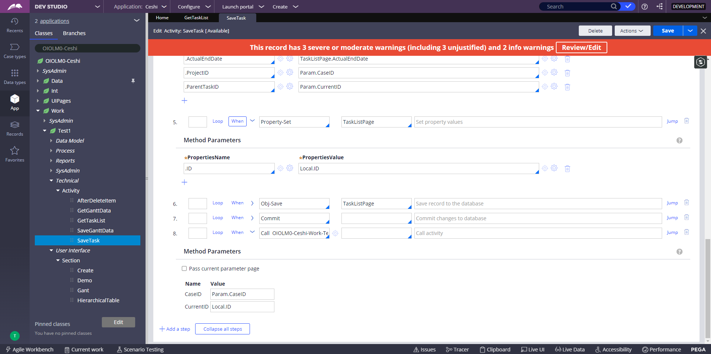

3、删除数据

(1) AfterDeleteItem，删除以后要调用一下保存

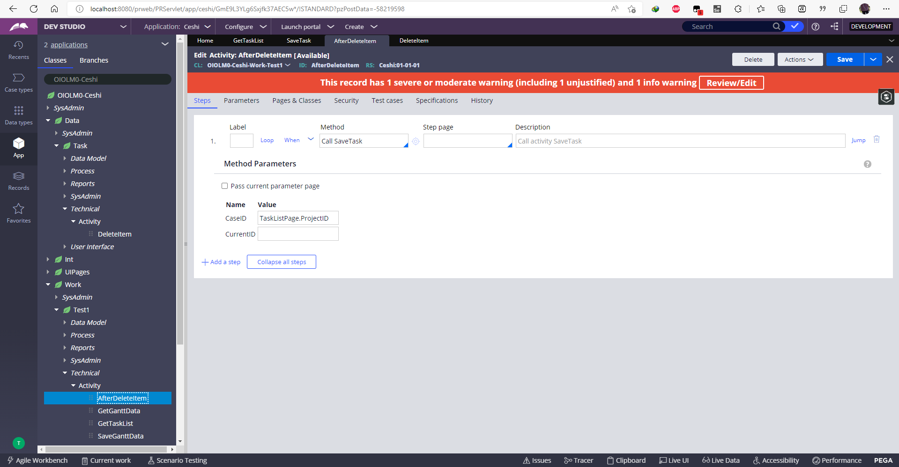

(2) DeleteItem

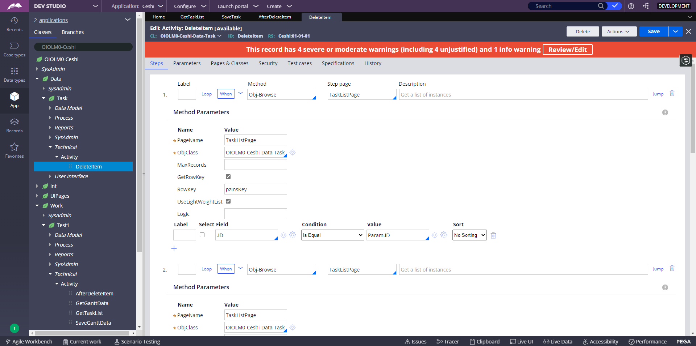
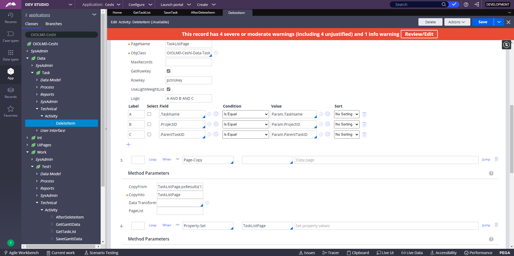
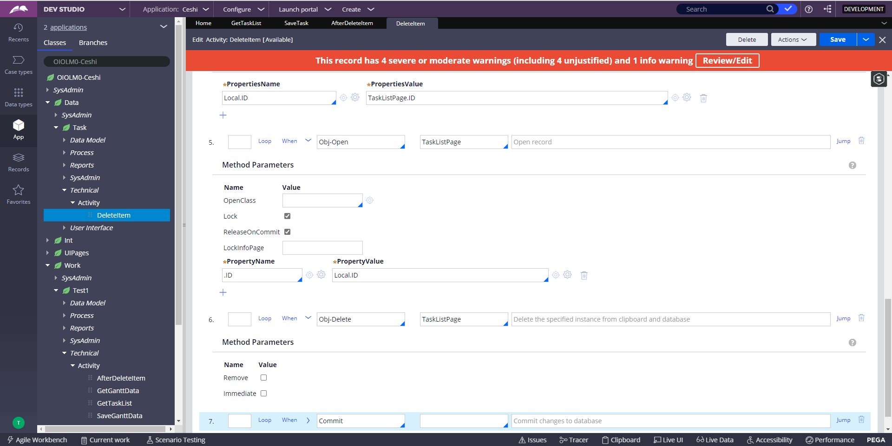

